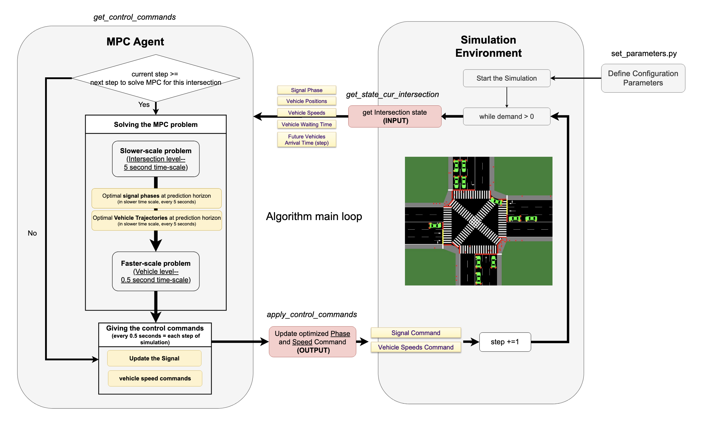

# MMSVCC (Multimodal Multiscale Signal-Vehicle Coupled Control)

## About
This project involves the implementation of an MPC-based Signal-Vehicle Coupled Control (SVCC) model (Developed by Dr. Qiangqiang Guo (guoqq77@gmail.com)) on a single unified 4-leg, 3-lane intersection (inspired by the intersection at Fairview Avenue and Denny Way, Downtown Seattle, WA). The optimization process aims at maximizing throughput, minimizing the total delay and fuel consumption of connected and automated vehicles (CAVs) at signalized intersections.

## Requirements
Python 3.12   
GAMS 46.5 ([Download](https://www.gams.com/download/))  
SUMO 1.20.0  ([Download](https://eclipse.dev/sumo/))  
traci  
sumolib  
numpy  
gamsapi  
matplotlib  

### Installation
Please follow the instruction on [this link](https://www.gams.com/latest/docs/API_PY_GETTING_STARTED.html) for installing the GAMS dependencies and troubleshooting if needed. 

## Structure
- `agent`: Contains the MPC Agent Class which includes the MPC Optimization process.  
    - gams_models: Contains GAMS files solving the Slower-Scale (A2), and Faster-Scale (A3) Optimization problems (refer to the paper [Guo and Ban (2023)](https://www.sciencedirect.com/science/article/abs/pii/S0191261523001121))  
- `config`: Contains functions for setting up the model parameters.
- `environment`: Contains SUMO files and configurations as well as single_intersection class which covers the route builder and network generator of simulation as well as the Input, Output Interfaces (communication with SUMO) for the Unified 4-leg intersection.
- `Results`: Contains Output files generated at the end of simulation provide the following metrics to compare the MMSVCC project performance with other signal timing scenarios (e.g., fixed-time and actuated)
- `Slides`: Contains detailed diagram and documentation on the algorithm.

The whole process is summarized in the diagram below:  

 
Detailed documentiations of the algorithm can be found in /Slides/documentation.docx.  
