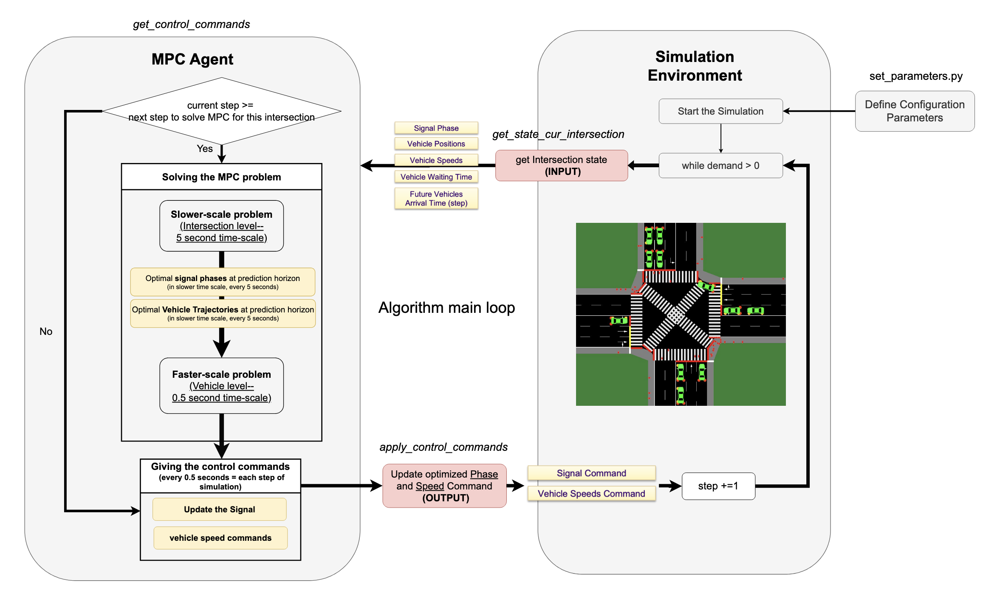
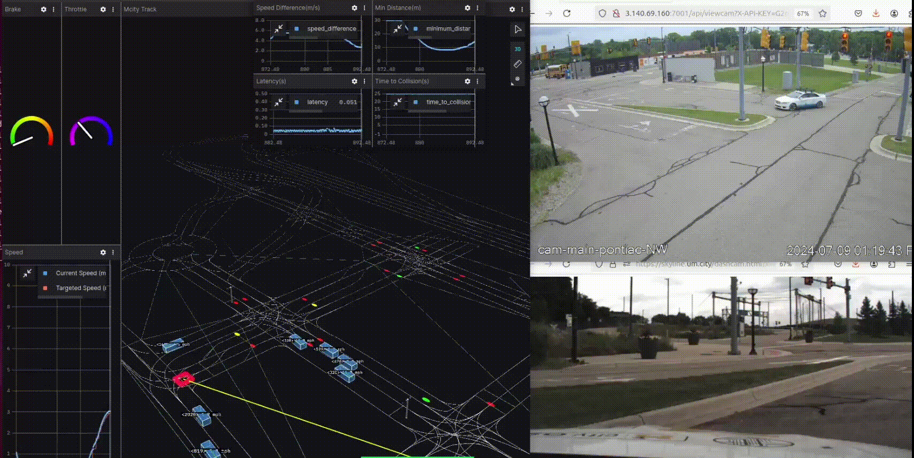
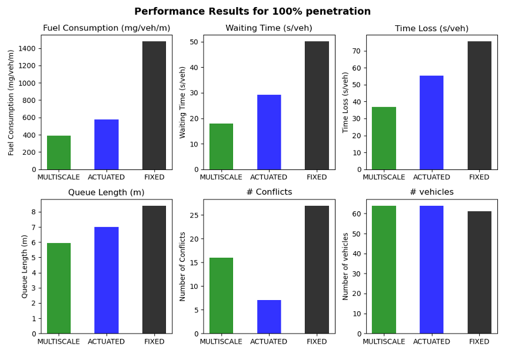
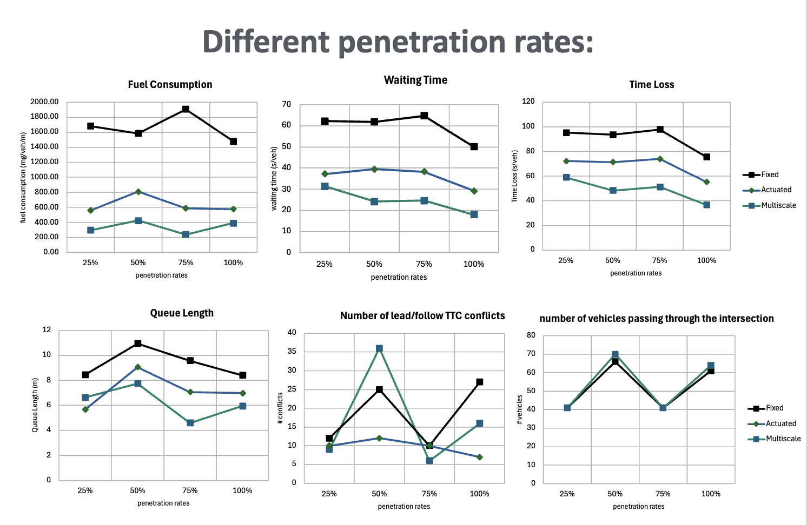

# M2SVCC (Multimodal Multiscale Signal-Vehicle Coupled Control)

## About
This project implements a Model Predictive Control (MPC)–based Mixed-Integer Nonlinear Programming (MINLP) **optimization framework** for multimodal signal–vehicle coupled control with Connected and Automated Vehicles (CAVs). The framework jointly optimizes traffic signal timing and CAV trajectories to maximize throughput, minimize user delays, and reduce fuel and energy consumption at signalized intersections, and has been successfully **deployed and validated in the real-world** Mcity Test Facility.

The whole process is summarized in the diagram below:  


Within a Python-based environment, the system operates in a closed loop where traffic states are continuously updated through SUMO, optimized control actions are generated using GAMS, and the resulting signal timings and vehicle trajectories are fed back into the simulation for real-time control


## Requirements
| Dependency | Version | Notes |
|------------|---------|-------|
| Python | 3.12 | |
| [GAMS](https://www.gams.com/download/) | 46.5 | Requires valid license; see [Python API setup](https://www.gams.com/latest/docs/API_PY_GETTING_STARTED.html) |
| [SUMO](https://eclipse.dev/sumo/) | 1.20.0 | Must be on `PATH`; set `SUMO_HOME` env variable |
| numpy | latest | |
| matplotlib | latest | |
| gamsapi | matched to GAMS 46.5 | Installed via GAMS installer, not pip |
| traci | latest | Bundled with SUMO |
| sumolib | latest | Bundled with SUMO |

## Structure

```
M2SVCC/
├── main.py                      # Entry point — configure and run a scenario here
├── setup.py                     # Package setup
├── Requirements.txt             # Python dependencies
│
├── agent/
│   ├── mpc_agent.py             # MPC agent: orchestrates A1/A2/A3 control loop
│   └── gams_models/             # GAMS files for A2 (signal) and A3 (trajectory) optimization
│
├── environment/
│   └── single_intersection.py   # SUMO interface: network builder, TraCI I/O, metrics
│
├── configs/
│   └── set_parameters.py        # All model parameters: phasing, turning treatments, demand
│
├── Results/                     # Simulation output (generated at runtime)
└── Slides/
    ├── Diagram2.png             # Architecture diagram
    └── documentation.docx       # Detailed algorithm documentation
```


## Usage
To change the scenario, edit the bottom of `main.py`:

```python
if __name__ == "__main__":
    main(
        network_type="single_intersection",
        volume_type="asymmetric",   # "symmetric" | "asymmetric"
        control_type="multi_scale"  # "multi_scale" | "actuated" | "fixed_time"
    )
```
  
> **Signal phasing** (concurrent vs exclusive) and **turning treatment** (permitted, protected, LPI/LBI, delayed right turn) are configured in `configs/set_parameters.py`.

#### Key parameters (`configs/set_parameters.py`)

| Parameter | Description | Options |
|---|---|---|
| `phasing` | Active user crossing type | `concurrent`, `exclusive` |
| `turning_treatment` | Vehicle-pedestrian conflict handling | `permitted`, `protected`, `LPI`, `LBI`, `delayed` |
| `bike_mode` | Cyclist infrastructure | `separated`, `mixed` |
| `vehicle_types` | Powertrain mix | `ICE`, `hybrid`, `EV` (combinable) |
| `ped_demand` | Pedestrian arrival rate | float (veh/s) |
| `bike_demand` | Cyclist arrival rate | float (veh/s) |

## Real-world testing and results
Deployment at Mcity physical automated vehicle testbed, University of Michigan:  


#### Performance Metrics:  

evaluated performance in simulation and real-world deployment (Mcity testbed), achieving >25% improvement in system efficiency:
<table>
  <tr>
    <td align="center">
      
    </td>
    <td align="center">
      
    </td>
  </tr>
</table>

## Contributors

- **Shakiba Naderian** · University of Washington · [naderian@uw.edu](mailto:naderian@uw.edu)
- **Qiangqiang Guo** · Google · [guoqq77@gmail.com](mailto:guoqq77@gmail.com)
- **Xuegang (Jeff) Ban** · University of Washington

## Related work

This project builds on the unimodal SVCC framework introduced in:
> Naderian, S., et al. (2026). *Multimodal MultiScale Signal-Vehicle Coupled Control* (in press). [(link)](https://papers.ssrn.com/sol3/papers.cfm?abstract_id=6172842)
  
> Guo, Q., & Ban, X. (2023). *A multi-scale control framework for urban traffic control with connected and automated vehicles* Transportation Research Part B. [(link)](https://www.sciencedirect.com/science/article/abs/pii/S0191261523001121)

Real-world validation of the base SVCC model was conducted at the Mcity connected and automated testbed:

> Naderian, S., et al. (2025). *Testing Multiscale Signal-Vehicle Coupled Control with Connected and Automated Vehicles through remote access of Mcity 2.0* [(link)](https://papers.ssrn.com/sol3/papers.cfm?abstract_id=5202811)

